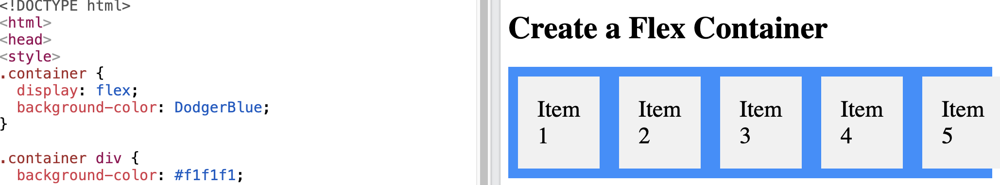
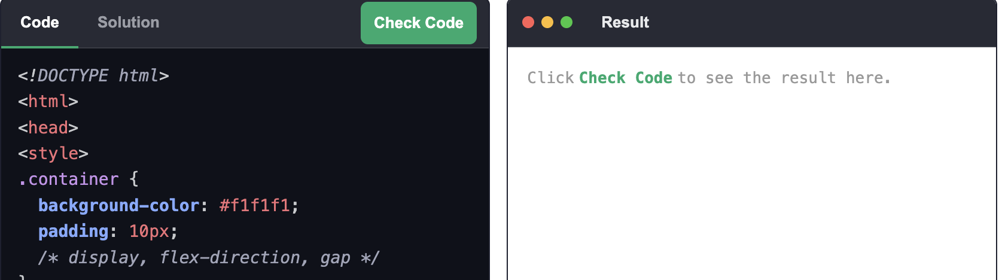
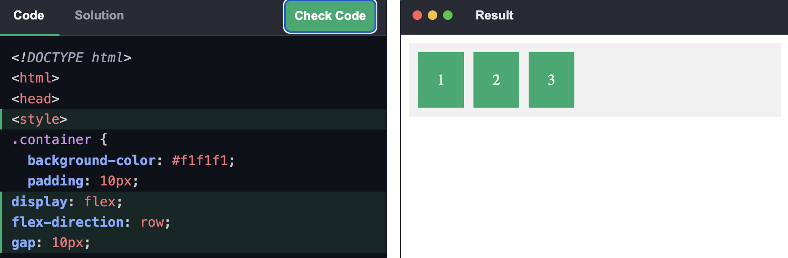
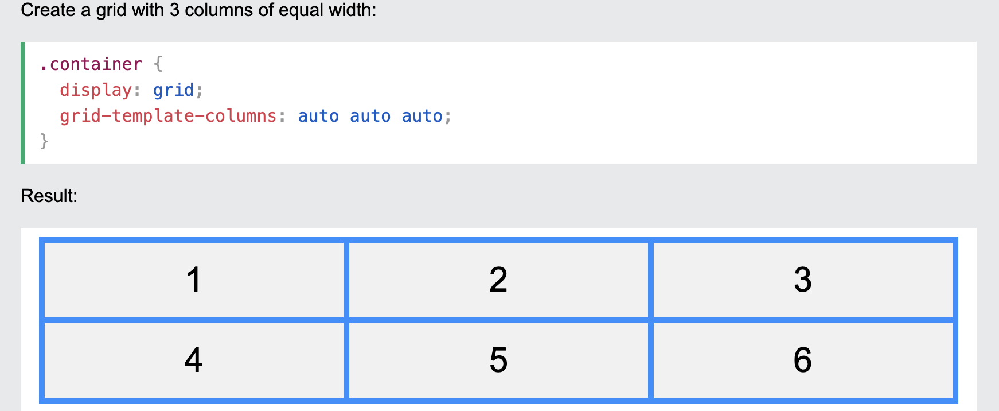
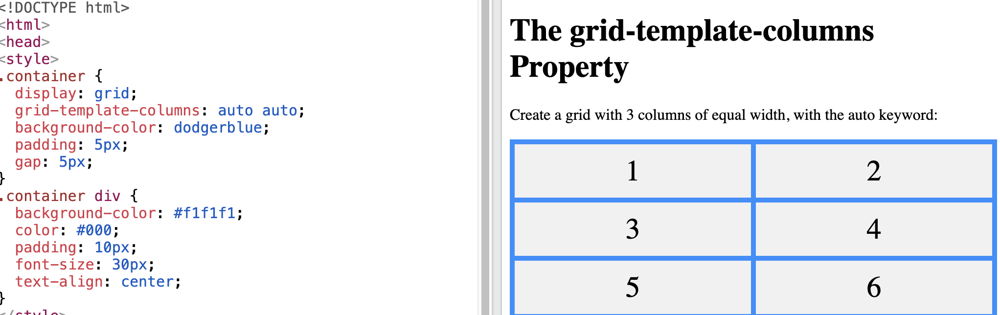

# Entry 4
##### 3/9/2026

## Content
Part of coding our website is going to know how we are going to code it. This means we are researching tools that we feel confident with using while coding. I did my own research, and here are the tools I picked: CSS flexbox, CSS grid, and Aframe.

### CSS flexbox
I chose CSS flexbox because I find it easy to work with. Using this [website](https://www.w3schools.com/css/css3_flexbox.asp), they gave many examples and readings on how to use CSS flexbox. I took this into consideration and started practing the codes that they had set up for me to practice.

For example,

 </img>

This shows a flex box for CSS. What this does is that it helps align, arrange or distribute spaces within a container. It arranges them horizontally, or vertically (rows or columns) in a responsive way. The code in the ` .container ` selector, ` display: flex; ` makes the element into a container so that ti can automatically be responsive. There are also other flexbox properties thats similar to ` flex `.

A few of these are:

 * ` flex-direction ` - Sets the display-direction of flex items (rows/column)
 * ` flex-wrap`- Specifies whether the flex items should wrap or not
 * `justify-content` - Aligns the flex items when they do not use all available space on the main-axis (horizontally)
* `align-items` - Aligns the flex items when they do not use all available space on the cross-axis (vertically)

 </img>

If we apply the `display` and `flex-direction` it will turn out to be:

 </img>

### CSS grid

This was my second option in researching a tool to use for my projext. Using the same website as CSS flexbox, I learned The Grid Layout Module offers a grid-based layout system, with rows and columns. The *Grid Layout Module* makes it easy to design a responsive layout structure, without using `float` or positioning.

One of the things I had tinkered with is the CSS grid-template-columns Property.

* `grid-template-columns` - Defines the number and width of the columns in the grid
* `grid-template-rows` - Defines the number and height of the rows in the grid
* `grid-template-areas` - Defines how to display columns and rows, using named grid items

I chose one of the three, which is `grid-template-columns`. If we're defining the number and width of the colums in the grid, there is different common values to do this.

* Fixed lengths (100px 300px 200px)
* Percentages (20% 60% 20%)
* fr unit (1fr 2fr 1fr)
* auto (auto auto auto)
* repeat() (repeat(3, 1fr))
* minmax() (minmax(80px, 1fr) 150px 150px)

I worked with the `auto`. This means that the `auto` creats however many columns. If you put 1x auto, then there will only be one column. If you put 2x auto, then here will be 2 column.

Heres an example:

 </img>

There is 3x auto, meaning there will be 3 columns created. If there would be 2x auto, then it will look like this:

 </img>

You can already probably guess what it'll look like if there were only 1 auto.

### Aframe

This was my 3rd option as a tool to use for my project. This [website](https://aframe.io/) can help create VR experiences and 3D models. To use this code, it's mainly based off of using HTML. To apply this, we're going to need to apply the starter code `  ` for the Aframe codes to work.

 One the best things about these website is that it has already given you most of the code. You just have to copy and paste then edit it yourself to your liking.

 For example, if I want a sphere, then I would go to sections full of shapes and go to sphere to copy and paste this code: ` <a-sphere color="yellow" radius="5"></a-sphere> `. This is already set up as: 

[Previous](entry03.md) | [Next](entry05.md)

[Home](../README.md)
