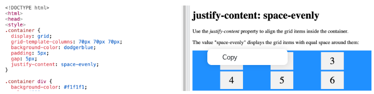
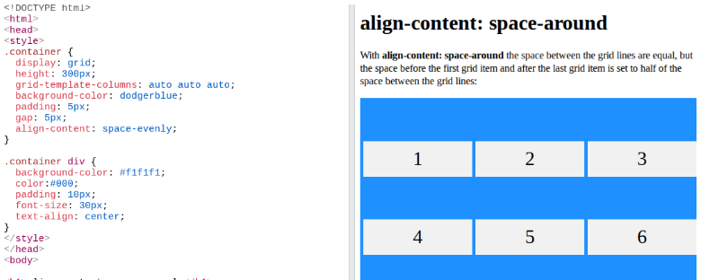

# Entry 5
##### 4/17/26

## Content
Continuing with learning our tools for our end of year project (freedom project), we have to continue to dig depper into our tools that we are going to apply on our website for the project. I'm learning the tool of CSS Grid, and I am using [w3schools](https://www.w3schools.com/) to learn. I'm also taking notes that I learned and putting it in my IDE so I can go back and look at it any time I need to when we are coding the website.

I originally thought there was only one css property to space things evenly, which was `justify-content`, but turns out there also another one! `justify-content` is used to space things evenly inside a container horizontally. I found out that `align-content` is used to space things evenly inside a container vertically.

#### Using `justify-content` as an example:
This CSS property spaces things horizontally inside the container evenly when there are spaces available.
 </img>

#### Using `align-content` as an example:
This CSS property spaces things vertically inside the container evenly when there are spaces available.
 </img>

## Skills

### Focusing
Focusing is pronbably a skill you'll have to learn when you get older because you can't always get distracted when your doing something important. Lets just say if you have a job, you need to be focused on your work and not get distracted by small things or your phone.

I have a hard time focusing when an assignment is too boring because it just doesn't catch my interest. But, I force myself to put my phone down or any sort of distraction to me that's in my way of completing my homework. This allows me to be focused on my work quicker, and more focused since I don't have distractions. By some miracle, this techique or tactics be invested or interested in the work.

[Previous](entry04.md) | [Next](entry06.md)

[Home](../README.md)
