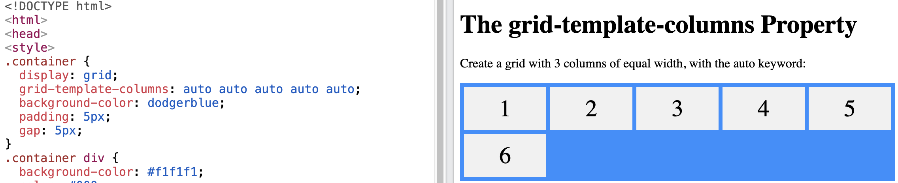
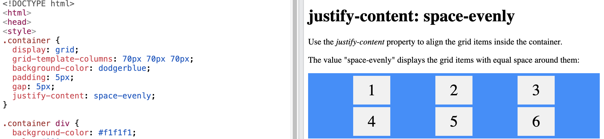
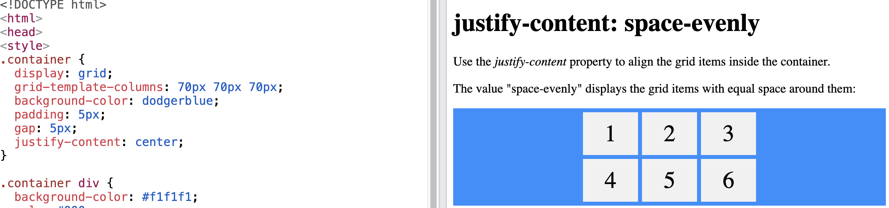

# Tool Learning Log

## Tool: **CSS flexbox/grid**

LL1

### 3/14/16: CSS Flexbox
[Link](https://www.w3schools.com/css/css3_flexbox.asp)

* CSS Flexbox Components

    * `display` property set to `flex` or `inline-flex`
    * `flex direction` property set the direction of flex items

      * Values for `flex-direction`: `row` `column` `row-reverse` `column-reverse`
    * `justify-content` property aligns flex item horizontally

        * Values: `center` `flex-start` `flex-end` `space-around` `space-between` `space-evenly`

LL2
### 3/29/26: CSS Grid
[Link](https://www.w3schools.com/css/css_grid.asp)

* `grid-template-columns: auto auto auto` shows how many columns there is

    * `auto` = one column
    * `auto auto` = two column
    * `1fr` splits the column evenly
    * `2fr` sets it as twice as big

I used the `grid-template-coumn` property and used 5 `autos` and made 5 columns.
</img>

* You can set the column sizes

  *  `grid-template-columns: auto auto auto;`

* A `gap` allows spaces between the grids

  * Gaps between `column` and `row`
  * `column-gap` - Specifies the gap between grid columns
  * `row-gap` - Specifies the gap between grid rows
  * `gap` - Shorthand property for row-gap and column-gap

  LL3
  ### 4/11/26: CSS Grid justify-content

  * You can use `justify-content` for grid containers
    * `justify-content` - Aligns the grid content when spaces are available (horizontally)
    * `align-content` - Aligns the grid content when spaces are available (vertically)

  * For CSS justify-content property:

    * `space-evenly`
    * `space-around`
    * `space-between`
    * `center`
    * `start`
    * `end`

Example with the `space-evenly` property:
 </img>

Example with the `center` property:
 </img>

LL4 (CSS place-content property)

<!--
* Links you used today (websites, videos, etc)
* Things you tried, progress you made, etc
* Challenges, a-ha moments, etc
* Questions you still have
* What you're going to try next
-->
